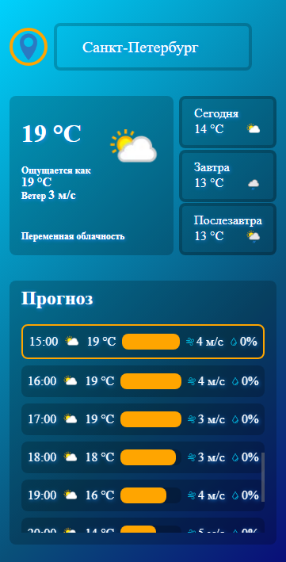

# 🌤️ Weather Report App

Простое и стильное погодное приложение, использующее [WeatherAPI](https://www.weatherapi.com/) для получения текущей информации и прогноза на 3 дня. Позволяет выбрать город, посмотреть погоду по часам и быстро перейти к текущему времени.

---

## 📸 Скриншот



---

## 🚀 Функциональность

- Просмотр текущей погоды: температура, ощущается, ветер, состояние.
- Прогноз на сегодня, завтра и послезавтра.
- Почасовой прогноз с визуализацией температуры, ветра и осадков.
- Смена города через кастомный выпадающий список.
- Анимированный прелоадер и обработка ошибок загрузки.
- Автоматическая прокрутка до текущего часа при открытии страницы.

---

## 🛠️ Технологии

- HTML5 + CSS3 (Sass)
- JavaScript (ES6+, `fetch`)
- [WeatherAPI](https://www.weatherapi.com/) (REST API)
- Файловая структура с разделением по `scripts`, `styles`, `assets`

---

## 📦 Установка и запуск

```bash
git clone https://github.com/your-username/weather-report-app.git
cd weather-report-app
npm install
npm run start # или открой index.html напрямую
```

## Перейти на сайт:

[Ссылка](https://weather-report-livid-five.vercel.app/)
